# TrueBuilt Wall & Room Detection Challenge

This repository contains my solution for the TrueBuilt Machine Learning Engineer Test.

It contains implementations for the following tasks:
1. **Wall Detection Task**: Detect walls on architectural blueprints.
2. **Room Segmentation Task**: Segment rooms based on the detected walls.
3. **API Server Task**: Create a simple API server that serves the wall detection and room segmentation algorithms.

*Full test description: [Senior Machine Learning Engineer.pdf](https://github.com/user-attachments/files/16702909/Senior.Machine.Learning.Engineer.pdf)*

*Data source and original test repo: [github.com/TrueBuiltSoftware/ml-eng-test/tree/main](https://github.com/TrueBuiltSoftware/ml-eng-test/tree/main)*

## Results using a custom trained CNN segmentation network


| Wall Segmentation using Custom CNN                           | Room Segmentation Based on CNN Predicted Walls               |
| ------------------------------------------------------------ | ------------------------------------------------------------ |
| 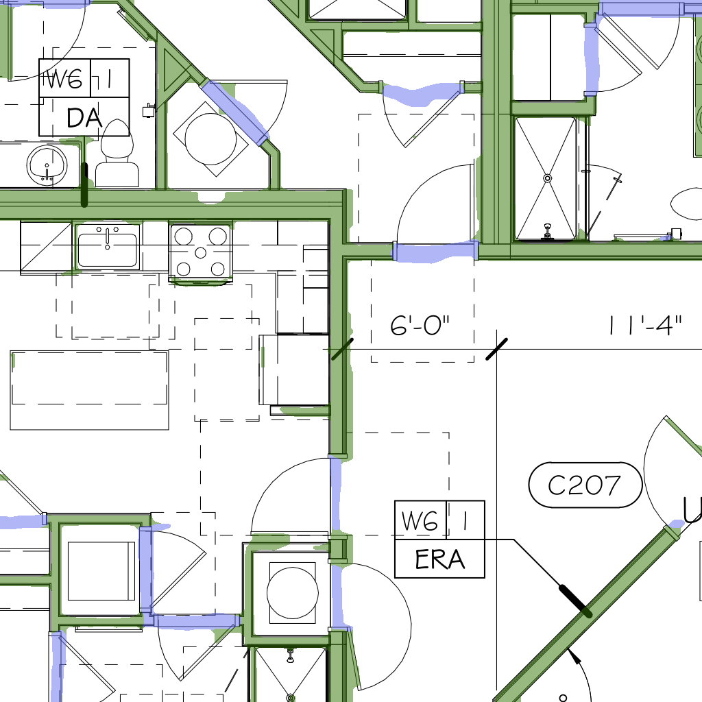 | 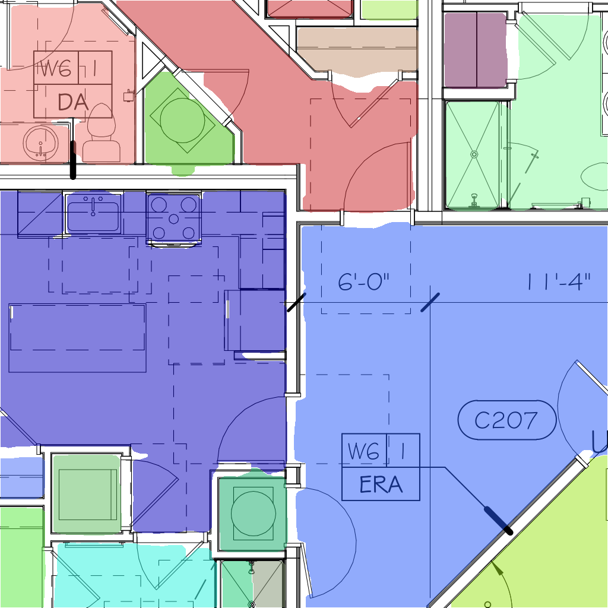 |
|  |  |
| 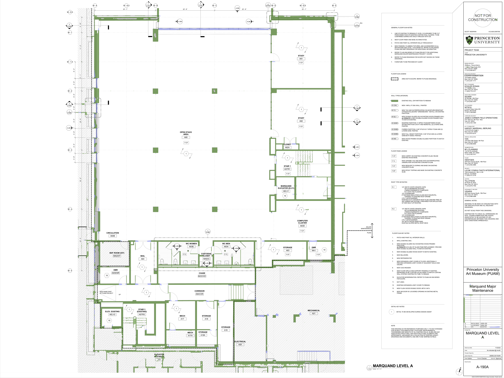                      |               |

### Highlights

|                                                              |                                                              |
| ------------------------------------------------------------ | ------------------------------------------------------------ |
| 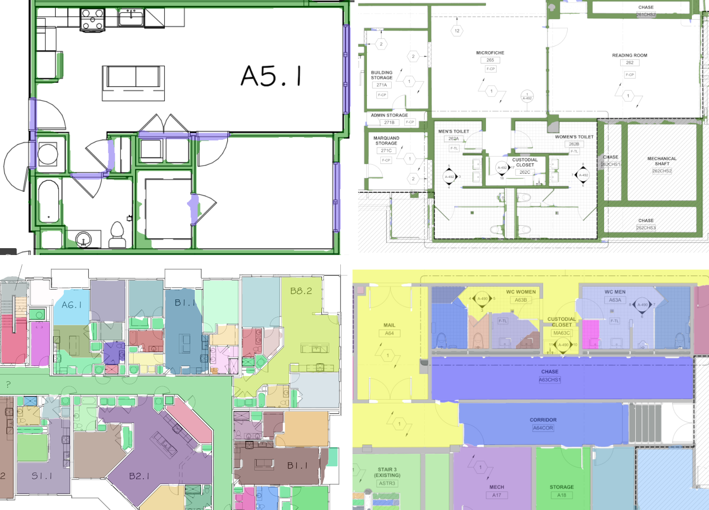                     | :globe_with_meridians: Accuracy generalises to all regions of all blueprints (Walls and Rooms dataset) |
| 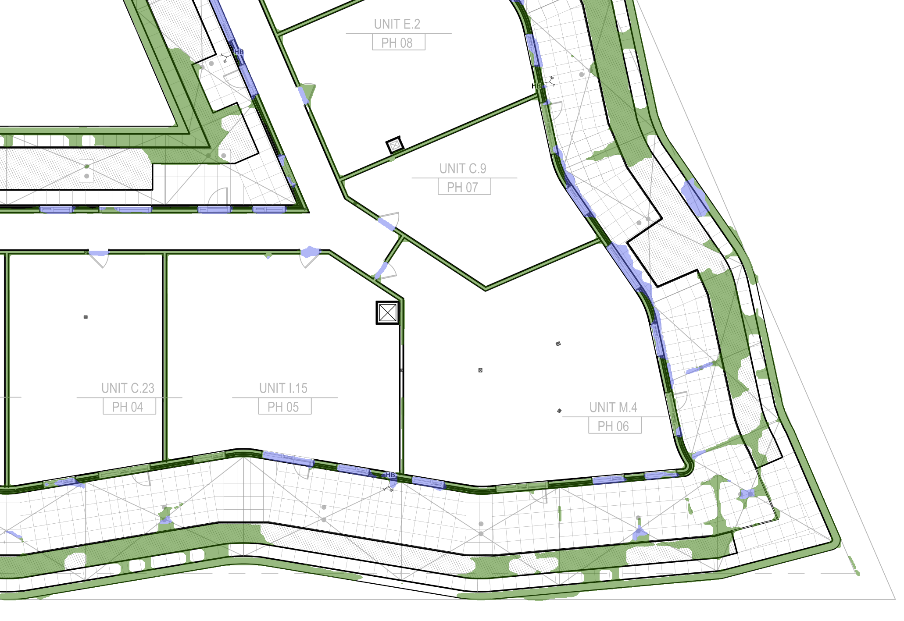                 | :o: Curved, angled walls detected as well                    |
| 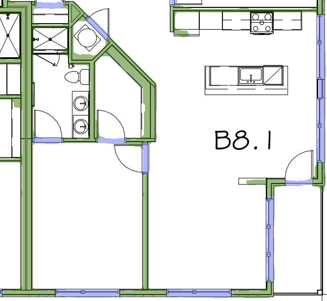 | :door: Doorways, windows detected<br />:green_square: Walls <br />:blue_square: Windows and doors |
| 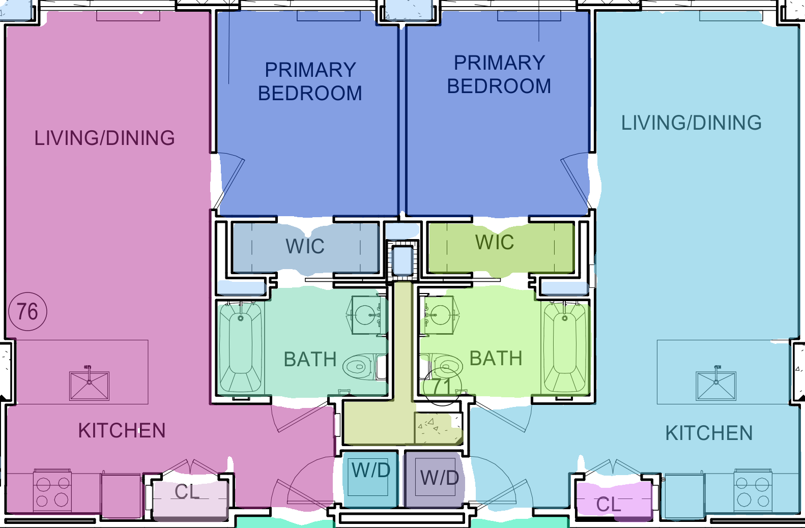 | :round_pushpin: Even small rooms, closets, utility rooms identified separately |
| 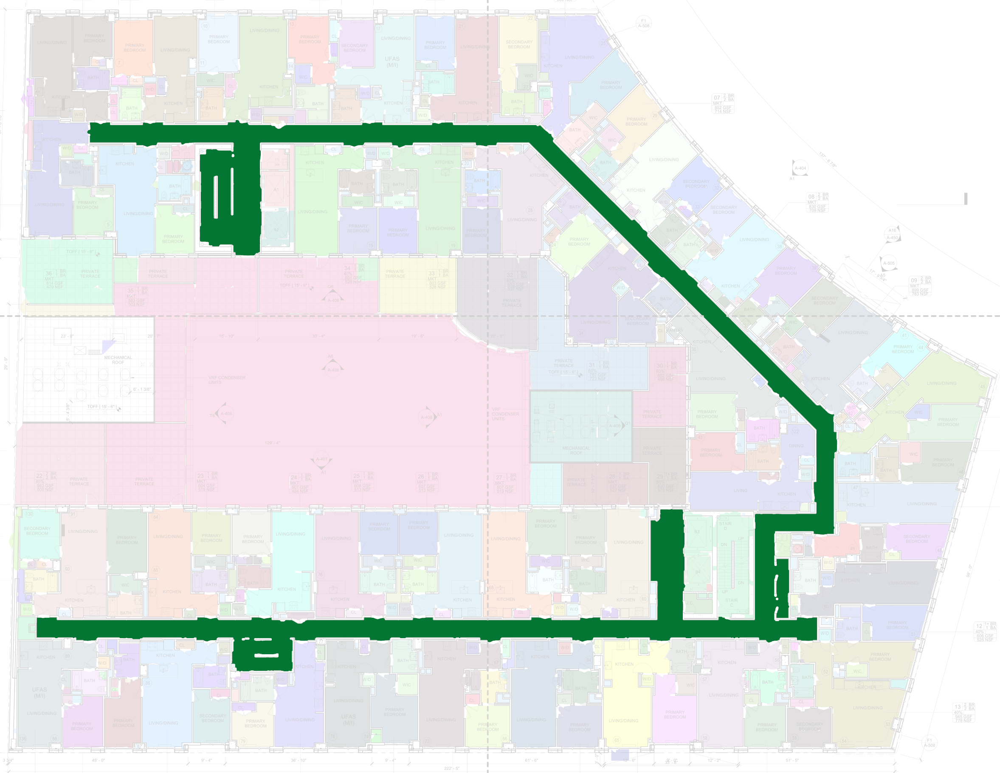 | :arrow_upper_left:Most corridors on the sample blueprints identified correctly |


**[:point_right: :framed_picture: See Release for results on all full blueprints :point_left:](https://github.com/kaland313/TrueBuiltWallSegmentationChallenge/releases)**

## My approach

:bulb:**Motivation: ​** Annotations, different line styles across the drawings make classical computer vision mehtods, suchs as line thickness threshold, morphological operations hard to tune and fragile. 
:arrow_right: **Method**: Use a small CNN model to segment the walls. 

1. Manually labelled a small crop from 3 of the provided blueprints. 

   - Manual labeling took ~1 hour, including training and validation regions

   - | Image                                                        | Image & Mask                                                 | Mask                                                         |
     | ------------------------------------------------------------ | ------------------------------------------------------------ | ------------------------------------------------------------ |
     | 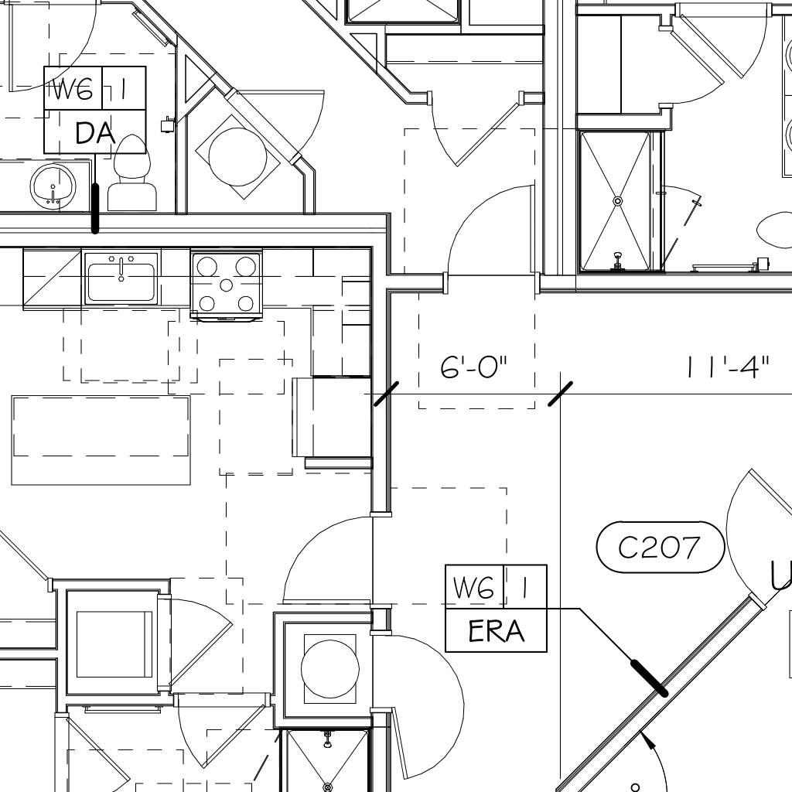 | 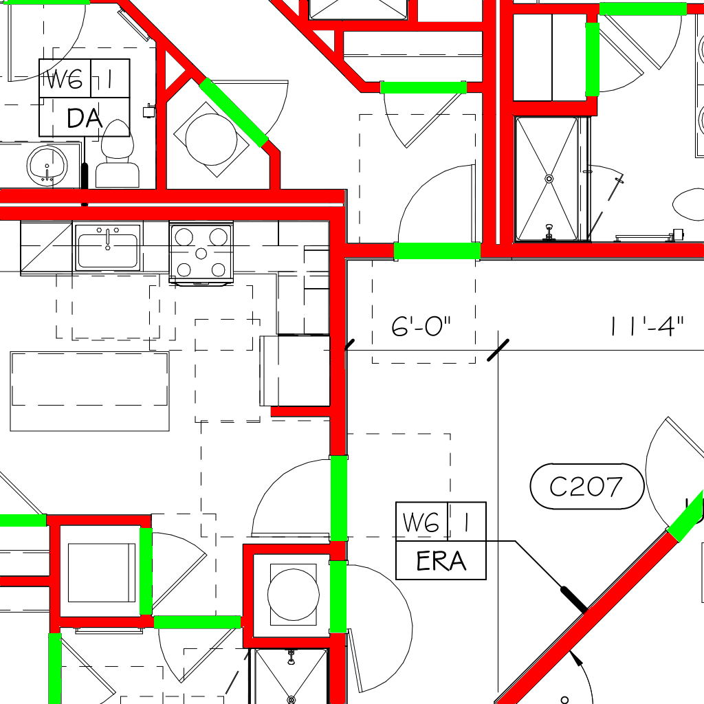 | 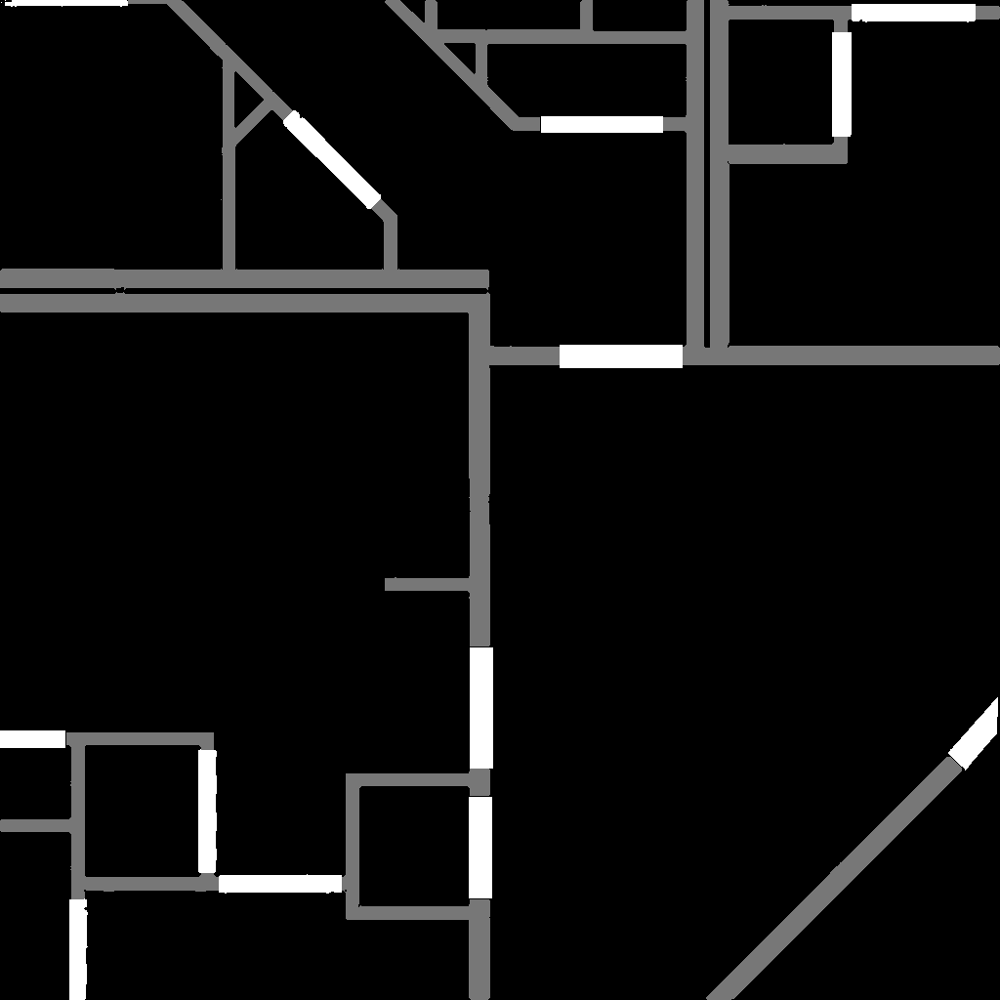 |
   
   - **Data used for training**:  [`data/train/`](data/train) and **validation**: [`data/val/`](data/val)
   - Initially, I labelled walls only, but later added doorways and windows as another class to make the room identification task easier. [`data/val/masks_wd/`](data/val/masks_wd/) includes masks with windows and doorways labelled, while  [`data/val/masks/`](data/val/masks/)  contains binary wall segmentation labels.
   - Additionally I created training and validation images with gray-filled walls to train the model to detect walls on blueprints from the Rooms dataset as well.
   
2. Train a small segmentation network on the 3 crops

   - :thought_balloon: ResNet-34 based segmentation network
   - :chart_with_downwards_trend: DiceLoss
   - :framed_picture: Heavy augmentation strategy (random cropping, distortions, etc.)
   - :hammer_and_wrench: Tools: PytorchLightning, Torchvision v2 transforms, SegmentationModelsPytorch
   - :whale: [`Dockerfile`](docker/Dockerfile) with fixed package versions provided for training
   - :package: Trained weights [uploaded in the release](https://github.com/kaland313/TrueBuiltWallSegmentationChallenge/releases)

3. Predict walls & Clean the predictions using morphological operations

   - Remove small and thin objects from the segmentation
   - Fill holes on the segmentation

4. Detect rooms on the cleaned wall segmentation

   1. Separate the areas enclosed by the walls using distance transformation and thresholding.
   2. Identify all connected components.
   3. Assign roob labels to pixels close to walls using the watershed algorithm
   4. Assign a random color to each room to visualize the segmentation 

5. API for serving the wall detection and room segmentation algorithms

   - :hammer_and_wrench: FastAPI & Uvicorn server, model served using ONNX supporting GPU and CPU inference (automatic fallback to CPU if no GPU is available)
   - :whale: Separate [`Dockerfile_serve`](docker/Dockerfile_serve) included for lightweight serving

#### Numeric results

To monitor the training I used Jaccard Index. With the small dataset, the utility of these numbers is limited, but they still provide insight into the model performance.

| Metric        | Train | Val  |
| ------------- | ----- | ---- |
| Jaccard Index | 0.97  | 0.95 |

| Train IoU Learning Curve                                     | Val IoU Learning Curve                                       |
| ------------------------------------------------------------ | ------------------------------------------------------------ |
|  |  |


## Running the API Server

The API server is implemented in FastAPI and can be run using the provided [`Makefile`](Makefile).

```bash
make serve-gpu
```
This will build the docker image for serving and start the server on `http://localhost:3000`, and you can access the API documentation at `http://localhost:3000/docs`. It requires the trained model to be present in the root directory as `model.onnx`.

The [`Makefile`](Makefile) includes environment variables for the model path and the port, which can be overridden if needed. 

```makefile
workdir=/workspace # Mapped to the root directory of the repo
host_port=3000
onnx_model_path=$(workdir)/model.onnx
```
To serve the model on a CPU run `make serve-cpu`.

### Example cURL

```bash
curl -OJ -X POST -F "image=@data/train/images/A-102 .00 - 2ND FLOOR PLAN CROP.png" "http://localhost:3000/run-inference?type=wall"
curl -OJ -X POST -F "image=@data/train/images/A-102 .00 - 2ND FLOOR PLAN CROP.png" "http://localhost:3000/run-inference?type=room"
```
By default the API returns wall and room mask visualizations, scaled or colorized for better visibility. You can also get the raw masks with segmentation indices from 0 by adding the `return_raw_segmentation_ids=true` query parameter to the request.

```bash
curl -OJ -X POST -F "image=@data/train/images/A-102 .00 - 2ND FLOOR PLAN CROP.png" "http://localhost:3000/run-inference?type=wall&return_raw_segmentation_ids=true"
curl -OJ -X POST -F "image=@data/train/images/A-102 .00 - 2ND FLOOR PLAN CROP.png" "http://localhost:3000/run-inference?type=room&return_raw_segmentation_ids=true"
```

Note the `-OJ` flags saves the response to a file. 

## Run training and inference 

### :whale: Build and run the training docker image

```bash
make run
```
This will build the docker image for training and start the container.

### :framed_picture: PDF conversion to PNG
```bash
python src/pdf_2_png.py datasets/Walls/ data/walls_png
python src/pdf_2_png.py datasets/Rooms/ data/rooms_png
```

### :running: Run training
```bash
python src/train.py
```
:timer_clock: Fully training the model for 500 epoch takes ~75 minutes on a single A100. 
Hyperparameters for the training are defined in [`src/model/config.yaml`](src/model/config.yaml).  

After the training is finished copy the best model checkpoint to the root directory as `model.ckpt`.
```bash
cp artifacts/TrueBuildchallenge/<BEST_MODEL_VERSION>.ckpt model.ckpt
```

### :arrows_clockwise: Convert model to ONNX for serving

```bash
python src/model2onnx.py model_wd_aug_fill.ckpt
```

### :door: Run wall segmentation predictions

To run wall segmentation predicitions on the Rooms and Walls datasets, expected to be at `data/walls_png` and `data/rooms_png`, execute the following commands:
```bash
python src/predict.py data/walls_png/ -o results_wall/walls
python src/predict.py data/rooms_png/ -o results_wall/rooms
```
The script expects the checkpoint in the root of the repo as `model.ckpt`. This can be overridden with the `-m` argument.

To run wall segmentation predictions on the training and validation sets, execute the following commands:
```bash
python src/predict.py data/train/images/ -o results_wall/train
python src/predict.py data/val/images/ -o results_wall/val
```

### :bed: Run room segmentation on the wall segmentation results
The room segmentation script loads the wall segmentation results and images from the corresponding directories and matches them based on the suffixes applied to the wall segmentation result filenames. 

To run room segmentation on the Rooms or Walls datasets, execute the following commands:
```bash
python src/predict_rooms.py -i results_wall/walls/ -o results_room/walls/ --img data/walls_png/
python src/predict_rooms.py -i results_wall/rooms/ -o results_room/rooms/ --img data/rooms_png/
```

To run room segmentation on the training and validation sets, execute the following commands:
```bash
python src/predict_rooms.py -i results_wall/train/ -o results_room/train/ --img data/train/images/
python src/predict_rooms.py -i results_wall/val/ -o results_room/val/ --img data/val/images/
```

Finally, the room segmentation algorithms can be tested on the ground truth masks for the training and validation sets. This is useful for testing the algorithms on clean wall masks.
```bash
python src/predict_rooms.py -i data/train/masks_wd -o results_room_gt/train --img data/train/images/ --file_suffix=".png"
python src/predict_rooms.py -i data/val/masks_wd -o results_room_gt/val --img data/val/images/ --file_suffix=".png"
```
