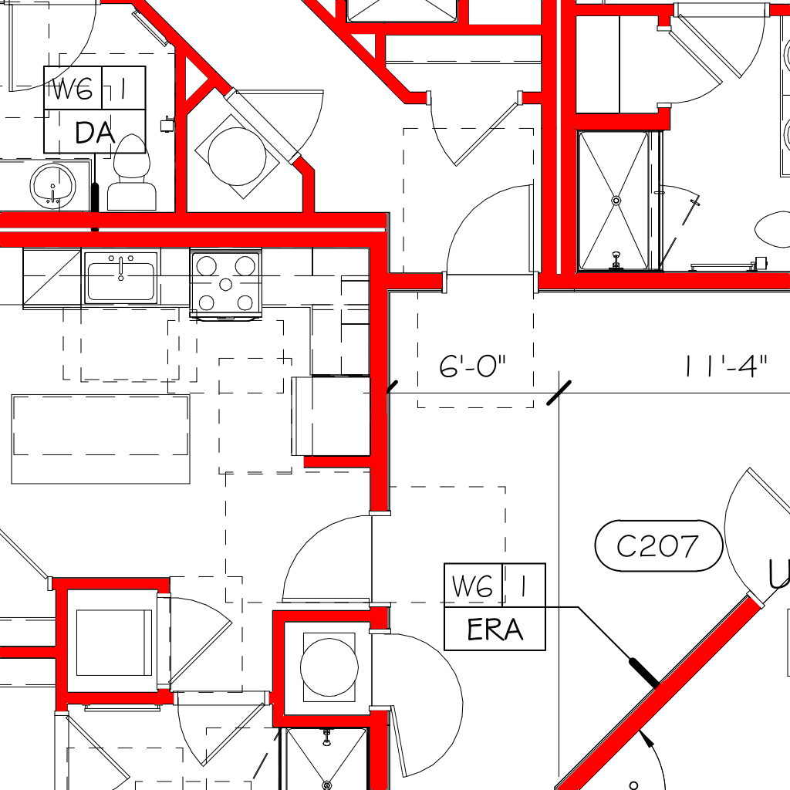
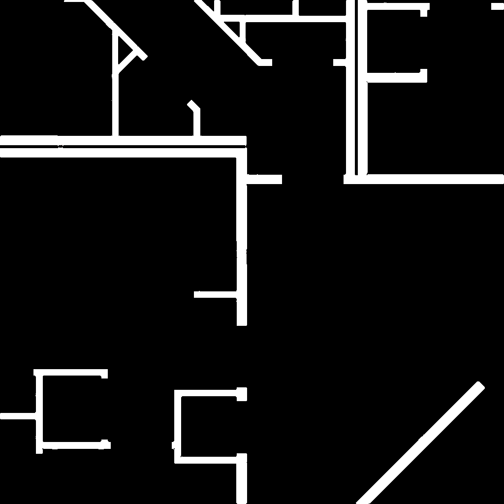
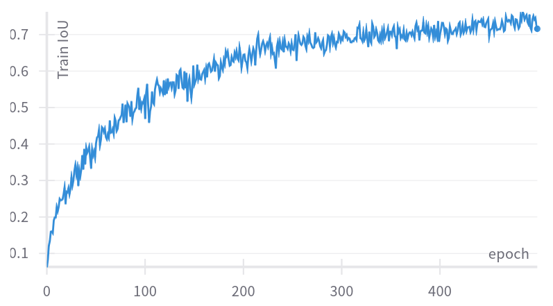
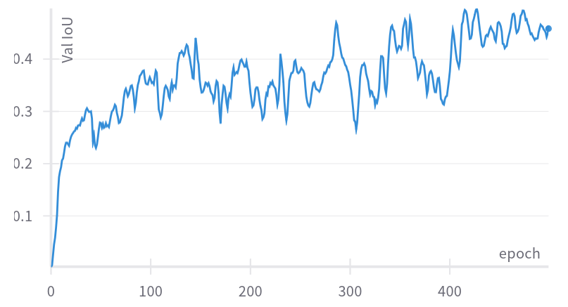

# TrueBuilt Wall & Room Detection Challenge

## Results using a custom trained CNN segmenation network

| Human Labeling                                               | CNN Segmentation Result                                      | CNN Segmentation Result Cleaned                              |
| ------------------------------------------------------------ | ------------------------------------------------------------ | ------------------------------------------------------------ |
|  |  |  |

:framed_picture: Full blueprint segmented; [[:point_right: open in a new tab:point_left:](.github/A-102 .00 - 2ND FLOOR PLAN_overlay_cleaned.jpeg)]

- :arrows_clockwise: Accuracy generalises to all regions of all blueprints
- :o: Curved walls detected as well

## My approach

1. Manually labelled a small crop from 3 of the provided blueprints. 

   - Annotations, different line styles across the drawings make classical computer vision mehtods, suchs as line thickness thresholding, morphological operations hard to tune and fragile.

   - Manual labeling took 30-45 minutes max, including training and validation regions

   - | Image                                                        | Image & Mask                                                 | Mask                                                         |
     | ------------------------------------------------------------ | ------------------------------------------------------------ | ------------------------------------------------------------ |
     |  |  |  |

   - In hidsight: 

     - probably should've labeled doorways as well for the room identification task
     - but that would increase labeling time notably

   - See the data used for training in [data/train](data/train) and [data/val](data/val)

2. Train a small segmentation network on the 3 crops

   - ResNet based segmentation network
   - DiceLoss
   - Heavy augmentation strategy (random cropping, distortions, etc.)
   - :hammer_and_wrench: Tools: PytorchLightning, Torchvision v2 transforms, SegmentationModelsPytorch
   - :whale: [Dockerfile](./Dockerfile) with fixed package versions provided for training
   - :package: Trained weights and blueprints with walls detected [uploaded as a release]()

3. Predict & Clean the predictions

   - Remove small and thin objects from the segmentation
   - Fill holes on the segmentation

### Numeric results

To monitor the training I only used Jaccard Index for now. The dataset is tiny, therefore this numbers don't say that much. 

| Metric        | Train | Val  |
| ------------- | ----- | ---- |
| Jaccard Index | 0.63  | 0.48 |

| Train IoU Learning Curve                                     | Val IoU Learning Curve                                       |
| ------------------------------------------------------------ | ------------------------------------------------------------ |
|  |  |

## 